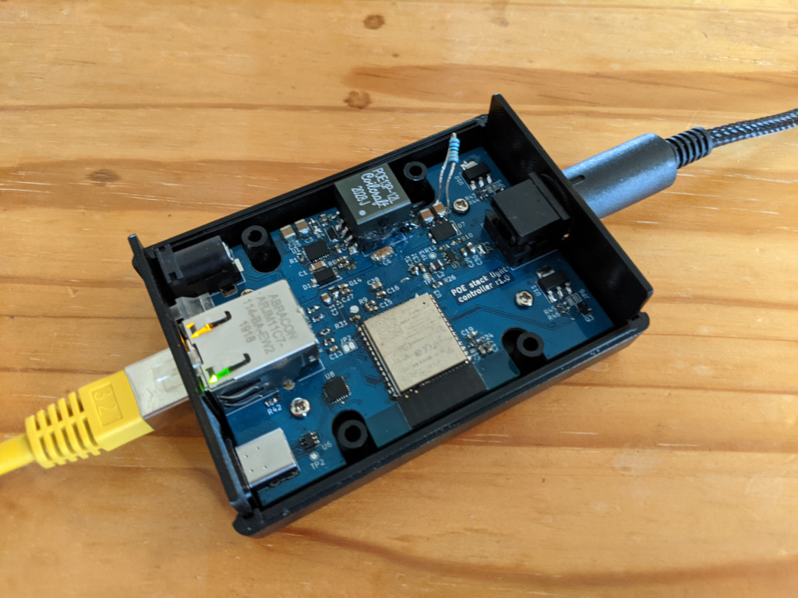
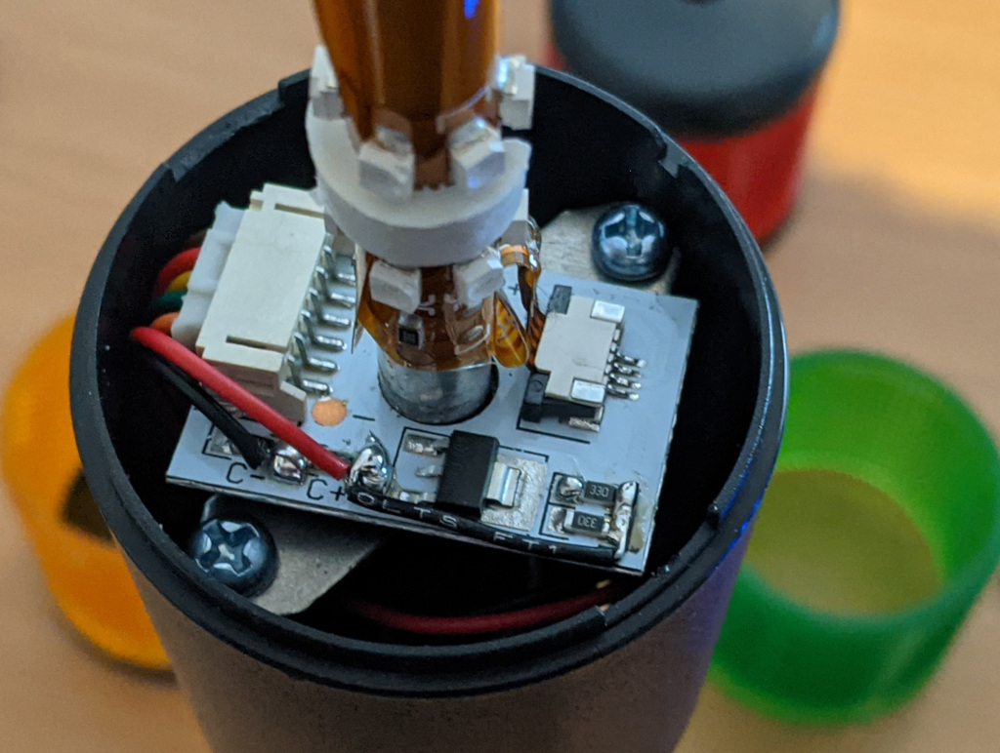

Stack Light Construction Guide
==============================

Control unit Construction
-------------------------

### PCB construction

The control unit PCB designs can be found on github https://github.com/Tyler-Ward/stacklight-hardware. The releases section contains the bill of materials (including digikey/mouser order numbers) as well as the prepared Gerber files for ordering the PCBs.

The board has been designed to support soldering with just a soldering iron however there are some fine pitch components so a small tip is needed. For soldering the ground pads on the ICs there are large via's in the ground pad that allow for soldering from the rear of the chip. The BOM lists the references of each component so can be used as a guide when building the board.

#### Assembly notes

* For ease of testing, JP3 which links the POE supply to the power supply for the control circuitry is by default open. You may wish to test the power supply before connecting this jumper.
* The two light pipes (H5 and H6) should friction fit into the board, depending on your boards tolerances you may need to glue them in place or enlarge the holes as required.
* Should you wish to prevent reprogramming in the field the jumpers JP1 and JP2 can be broken after initial programming to disable this functionality. They can be resoldered if it later needs reprogramming.

### Case installation



The PCB fits into a [Hammond 1593L](https://www.hammfg.com/electronics/small-case/plastic/1593) enclosure.
The light uses 3d printed end panels to replace the ones provided with the case.
STLs for printing these are included in the PCB release.
The front panel needs to be placed onto the board before the board is placed into the case, the rear panel can be added after the board is in place.

Light modification
------------------

The Light tower needs a couple of simple modifications to work with the control unit.
The design uses the [Adafruit 2993](https://www.adafruit.com/product/2993) light, other lights which use a common 12v supply and switched grounds will also work but the instructions below will need some modification, also the current limit in the controller may need adjusting.

### Bypassing the current limit

The internal current limit needs to be bypassed in order to allow multiple segments to be lit.
A separate current limit per segment is included in the controller to replace this one.

1. Remove the screw in the top of the light and take off the coloured sections.
2. for ease of access detach the inside pillar by removing the two screws holding it down. this will let the board come out of the base for soldering.
3. Solder a jumper wire between the resistors in the current limiter side furthest away from the regulator IC and the ref power wire going to the buzzer (see image below).
4. Replace the inside pillar.
5. Replace the coloured sections and reinstall the screw in the top.



### Adding the connector

The cable from the unit needs to be terminated in a 6 pin minidin connector.
I used a MD-60 from CUI however any 6 pin minidin connector should work.
You may also wish to add some cable sleving to neaten up the cables.
The pinout of the mini din connector is shown in the table below.

Pin | function | colour in supplied cable
--- | --- | ---
1 | 12v power | brown
2 | Red segment Ground | red
3 | Yellow segment ground | yellow
4 | Green segment ground | green
5 | Buzzer ground | orange
6 | NC | NA |

Firmware installation
---------------------

The firmware for the deice can be found on github at https://github.com/Tyler-Ward/stacklight-firmware

### Flashing via the build system

The firmware can be installed by using the build system to build and flash the firmware. This requires a functioning esp32 idf build environment to work.

The command ```idf.py -p (port) flash``` will build the firmware and flash the board when run within the build directory.

### Flashing a release with esptool

If you want to flash a release via esptool the following command will flash the device, change the port to the correct one for the device

```
esptool.py -p (PORT) -b 460800 --before default_reset --after hard_reset --chip esp32  write_flash --flash_mode dio --flash_size detect --flash_freq 40m 0x1000 bootloader.bin 0x8000 partition-table.bin 0x10000 stack-light.bin 0x110000 web_content.bin
```

### Flashing a release via esp32 flash download tool

If you use the GUI esp32 flash download tool you will need to set the following options

The sections options should match the table below.

file | address
--- | ---
bootloader.bin | 0x1000
partition-table.bin | 0x8000
stack-light.bin | 0x110000
web_content.bin | 0x110000

The following options should also be setup

* SPI speed: 40Mhz
* SPI Mode: DIO
* FLASH SIZE: 32Mbit
* Port: com port for device
* Baud 460800

After flashing you will need to disconnect the device from both network and usb to get it to reboot into the firmware

Additional Steps if building units for distribution
---------------------------------------------------

The downloadable firmware images and source code use a development and testing ESTA manufacturer id. This is fine if you are using the units yourself but if distributing the units then you will need to apply for an ESTA manufacturer ID and replace the one included in the firmware. More details are provided in the product_ids.h file included in the firmware source code.
