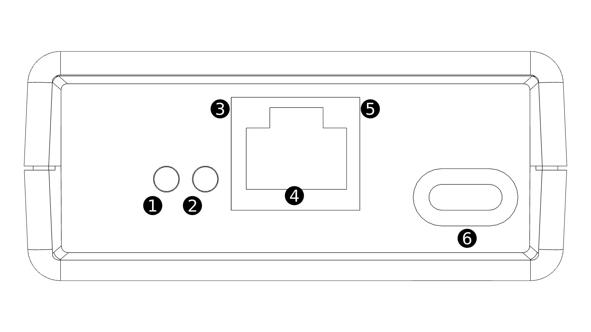
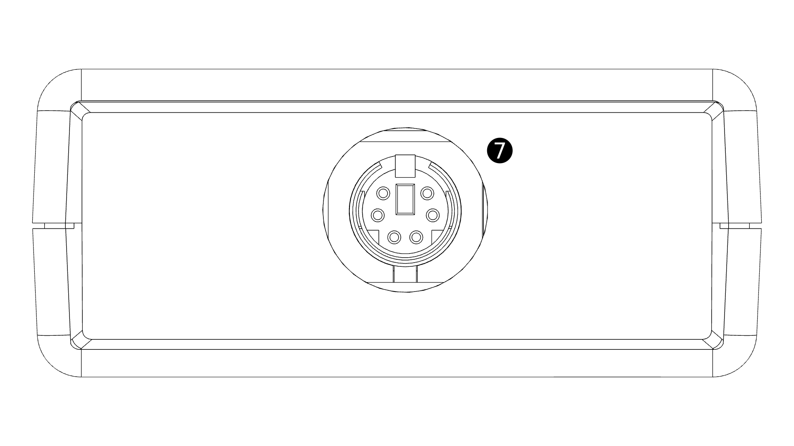

Stack Light User Guide
======================

connections and indicators
--------------------------





1. Locate indicator
2. Art-Net indicator
3. Status indicator
4. LAN connection
5. Link status indicator
6. USB programming interface
7. Light connector

Basic Usage
-----------

To setup the light the light needs to be plugged into the control box then the control box should be connected to the network on a POE enabled port.

If using over Art-Net interface then the lighting console will be able to detect the light automatically. If using over HTTP then the device uses the client name stacklight when requesting a DHCP address if you DNS server automatically provides DNS entries for clients. The IP address is also printed to the console during boot as another way to locate the device.

##### DMX channels

The device uses four DMX channels which are described below. The device can be patched to the required Art-Net universe and DMX address either through the lighting console if it supports configuring remote devices or via the HTTP interface.

Channel | Function
---  | ---
1 | Red segment intensity
2 | Yellow segment intensity
3 | Green segment intensity
4 | Buzzer intensity (value causes both tone and volume change)

##### HTTP API

To control the light over HTTP you can either use the web interface or can set the state using a post message to the set endpoint. an example command and the list of valid mode parameters are shown below

```
curl --data "mode=red" http://<device ip>/set
```

Mode | result
---  | ---
off  | no sections lit
red  | red lit
yellow | yellow lit
green | green lit
all | all segments lit

Indicator Meanings
------------------

##### Locate

The locate indicator is lit whenever the locate functionality in either the HTTP, Art-Net or RDM interface is requested, it can be cleared by clearing the locate request from any interface.

##### Art-Net

The Art-Net indicator is lit when the light is receiving valid Art-Net DMX packets. If unlit the light is not receiving Art-Net DMX data.

##### Status

Indicator is lit when the device is running. If off check the device is connected to a POE enabled network port.

##### Link status

Lit when the device has a valid network connection and has got an IP address over DHCP. If unlit check network connectivity on the used port.

About
-----

The POE stack light has been created by Tyler Ward www.scorpia.co.uk

The POE stack light is opensource hardware. The Hardware and documentation are CC-BY-SA-4.0 and the firmware is MIT licenced. Source code and design files can be found at the following links

* [Hardware](https://github.com/Tyler-Ward/stacklight-hardware)
* [Firmware](https://github.com/Tyler-Ward/stacklight-firmware)
* [Documentation](https://github.com/Tyler-Ward/stacklight-documentation)

#### Additional Acknowledgements


Art-Net™ Designed by and Copyright Artistic Licence Holdings Ltd
